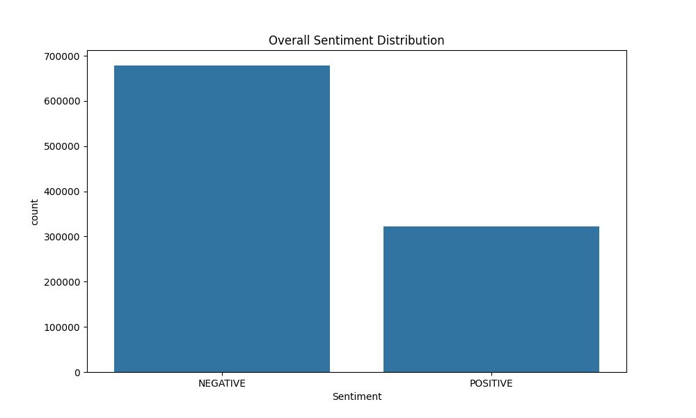
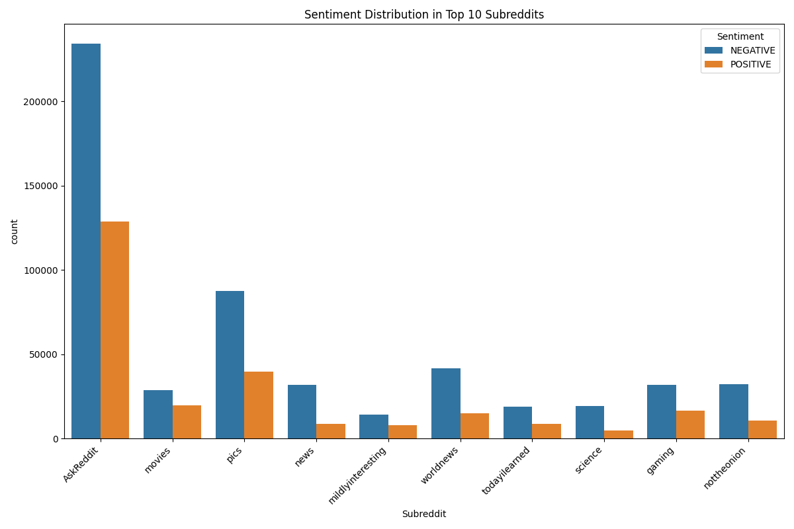

# reddit_NLP


## Table of Contents

1. [Overview](#overview)
2. [Project Structure](#project-structure)
3. [Features](#features)
4. [Installation](#installation)
    - [Clone the Repository](#clone-the-repository)
    - [Set Up Environment](#set-up-environment)
5. [Usage](#usage)
    - [Run the Sentiment Analysis](#run-the-sentiment-analysis)
    - [Explore the Results](#explore-the-results)
6. [Results](#results)
    - [Overall Sentiment Distribution](#overall-sentiment-distribution)
    - [Subreddit Sentiment Analysis](#subreddit-sentiment-analysis)
    - [Key Insights](#key-insights)
7. [License](#license)

## Overview

`reddit_NLP` is a data science project focused on sentiment analysis of Reddit comments. This project processes a large dataset of 1 million comments from various subreddits and performs sentiment analysis to understand the overall mood and opinions expressed by users.

## Project Structure

```
reddit_NLP/
├── data/                    # Folder for storing collected data
├── notebooks/               # Jupyter notebooks for exploratory analysis
├── src/                     # Source code for data collection, analysis, and visualization
├── README.md                # Project documentation
```

## Features

-   **Data Collection**: Utilizes Reddit's API to scrape 1 million comments from a diverse range of subreddits.
-   **Sentiment Analysis**: Implements various sentiment analysis techniques to classify comments as positive, negative, or neutral.
-   **Data Visualization**: Provides visual insights into the sentiment distribution across different subreddits and time periods.
-   **Customizable Parameters**: Allows users to adjust the number of comments or subreddits for data collection.

## Installation

To run this project, you'll need to have Python installed. Follow the steps below to get started:

1. **Clone the repository**:
    ```bash
    git clone https://github.com/your_username/reddit_NLP.git
    cd reddit_NLP
    ```
2. **Set up Reddit API credentials**:

## Usage

After setting up the environment and installing the necessary dependencies, you can start the data collection and sentiment analysis process.

1. **Run the data collection script**:

    ```bash
    python fetch_comments.py
    ```

    This script will use the Reddit API to scrape 1M comments based on the parameters set in the script.

2. **Perform sentiment analysis**:

    ```bash
    python sentiment_analysis.py
    ```

    This script will process the collected comments and classify them as positive, negative, or neutral.

3. **Visualize the results**:

    ```bash
    python visualize_results.py
    ```

    This script will generate various plots to help you understand the sentiment trends within the data.

## Results

The sentiment analysis of 1 million Reddit comments yielded insightful results about user opinions across various subreddits. Key findings include:

### Overall Sentiment Distribution



The analysis revealed the following sentiment breakdown:

-   Negative: 67.84%
-   Positive: 32.16%

This distribution suggests that Reddit comments tend to lean more towards negative sentiment, with about two-thirds of the analyzed comments classified as negative.

### Subreddit Sentiment Analysis



The sentiment distribution varies across different subreddits, as visualized in the chart above. This analysis helps identify which subreddits tend to have more positive or negative discussions.

### Key Insights

1. The overall negative sentiment bias (67.84%) could be indicative of the critical nature of discussions on Reddit or reflect the topics that were most discussed during the data collection period.

2. Despite the overall negative trend, nearly a third of comments (32.16%) express positive sentiment, showing that there's still a significant amount of positive interaction on the platform.

3. The variation in sentiment across subreddits (as shown in the subreddit sentiment distribution chart) suggests that the topic or community significantly influences the tone of discussions.

4. This analysis provides a foundation for more in-depth studies, such as investigating reasons behind sentiment trends in specific subreddits or tracking sentiment changes over time.

These results offer valuable insights into public opinion and discourse trends on Reddit, which can be useful for various applications such as market research, social studies, or platform moderation strategies.

To explore the data further or to see examples of positive and negative comments, run the `visualize_results.py` script, which provides sample comments for each sentiment category.
